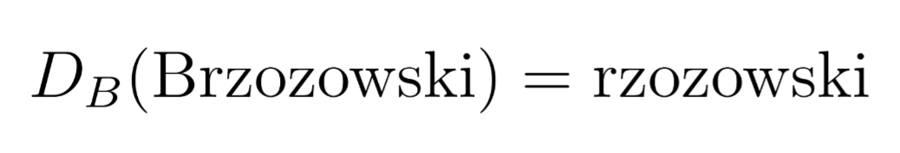

# rzozowski



*rzozowski* (ruh-zov-ski) is a Rust crate for reasoning about regular expressions in terms of Brzozowski derivatives.

<a href="https://crates.io/crates/rzozowski"></a> <a href="https://docs.rs/rzozowski"></a>

## What is a Brzozowski derivative?

Let's say we have a regular expression $R$ and a character $c$. The Brzozowski derivative of $R$ with respect to $c$, written as $D_c(R)$, is a new regular expression that constitutes the remainder of $R$ after $c$ has been matched.

For example, if we have the regular expression $R = abc$ and the character $a$, the Brzozowski derivative is $D_a(R) = bc$.

For a more complex example, take the regular expression $R = a\*b$. Because $a$ can be matched multiple times, $D_a(R) = a*b$. If we instead take the derivative with respect to $b$, we get $D_b(R) = \epsilon$ (the empty string), because nothing can be matched after $b$.

## Why is this interesting?

We usually think of a regular expression as a finite automaton and the act of matching a string as the act of transitioning between the automaton's states. Instead, the Brzozowski derivative allows us to skip the finite automaton altogether and determine whether a string matches a regular expression by testing the derivative's nullability (i.e., whether it can match the empty string).

The algorithm is very intuitive (below in pseudocode):

```
R is a regular expression
s is a string

for char c in s:
    if R cannot accept c:
        s does not match R
    else:
        R = D_c(R)

if R is nullable:
    s matches R
else:
    s does not match R
```

## Really? Another regex crate?

I wrote this because I needed to calculate Brzozowski derivatives and couldn't find any satisfactory crates. Once I had implemented derivatives and parsing, it was only 7 more lines to implement matching. Thus, I had a regex crate.

**This crate does not aim to compete with existing regex crates.** For most scenarios, you should probably use a more established crate like [regex](https://github.com/rust-lang/regex) or [fancy-regex](https://github.com/fancy-regex/fancy-regex).

## Usage and features

Install with `cargo add rzozowski` or add to your `Cargo.toml`:

```toml
[dependencies]
rzozowski = "0.1.3"
```

Usage is very simple. *rzozowski* allows you to:

- Parse a `&str` into a `Regex`
- Convert a `Regex` into a `String`
- Calculate the derivatives of a `Regex`
- Simplify a `Regex`
- Check if a `&str` matches a `Regex`

Here's a simple example:

```rust
use rzozowski::Regex;

fn main() {
    let r = Regex::new("ca+b").unwrap();
    let s = "caab";
    assert!(r.matches(s));

    let derivative = r.derivative('c');
    assert_eq!(derivative, Regex::new("a+b").unwrap());
}
```

*rzozowski* supports the following regex features:

- Literal characters (e.g., `a`)
- Concatenation (e.g., `ab`)
- Alternation (e.g., `a|b`)
- Kleene star (e.g., `a*`)
- Plus (e.g., `a+`)
- Optional (e.g., `a?`)
- Character classes (e.g., `[a-z123]`, `\d`, `\w`)
- Counts (e.g., `a{3}`, `a{3,}`, or `a{3,5}`)
- Parentheses (e.g., `(ab)+`)

Note that *rzozowski* currently does not support capture groups, backreferences, or lookaheads. If you need these features, you should use a more established regex crate or submit a pull request to add them here :)

## Speed vs. the standard regex crate

*rzozowski* is dramatically slower than the standard `regex` crate at matching, and faster at parsing.

Benchmarking code can be found in the `benches` directory. I intend to perform more thorough benchmarking soon.

# Benchmark Results

## Regex Parsing Performance

| Category | rzozowski | regex | Ratio (rzozowski/regex) |
|----------|-----------|-------|--------------------------|
| Simple | 1.31 μs | 5.21 μs | 0.25 |
| Intermediate | 1.94 μs | 98.97 μs | 0.02 |
| Complex | 3.76 μs | 48.85 μs | 0.08 |

## Regex Matching Performance (valid inputs)

| Category | rzozowski | regex | Ratio (rzozowski/regex) |
|----------|-----------|-------|--------------------------|
| Simple | 1.91 μs | 11.42 ns | 167.63 |
| Intermediate | 106.42 μs | 32.57 ns | 3267.25 |
| Complex | 114.95 μs | 25.57 ns | 4496.19 |

## Regex Matching Performance (invalid inputs)

| Category | rzozowski | regex | Ratio (rzozowski/regex) |
|----------|-----------|-------|--------------------------|
| Simple | 1.56 μs | 7.89 ns | 198.34 |
| Intermediate | 75.87 μs | 13.55 ns | 5598.72 |
| Complex | 106.91 μs | 21.67 ns | 4932.49 |

## Further reading

Here are some resources that I found helpful in understanding Brzozowski derivatives:

- [Regular Expression Derivatives in Python](https://archive.fosdem.org/2018/schedule/event/python_regex_derivatives/) by Michael Paddon
- [Regular-expression derivatives reexamined](https://www.khoury.northeastern.edu/home/turon/re-deriv.pdf) by Owens *et al.*

## Contributing

Contributions are welcome! If you have any suggestions, bug reports, or feature requests, please open an issue or submit a pull request. Alternatively, you can email me at [feyles@icloud.com](mailto:feyles@icloud.com) if you'd like to chat.
